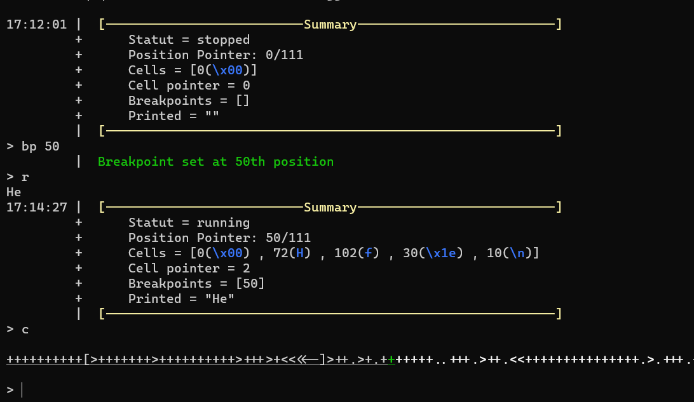

# BrainDbg
This tool is independent Brainfuck debugger , written in python


# Setup
```bash
cd ~
git clone https://github.com/Vozec/BrainDbg.git
cd BrainDbg
python3 braindbg.py -f ./examples/hello.bf
```

# Commands
```bash
Available Commande :
        - i/infos         => Show all general informations
        - c/code          => Show the current executed code
        - r/run           => Run the programm
        - c/continue      => Resume a paused execution
        - ni/n/next       => Execute the next instruction
        - bp/breakpoint   => Show all breakpoint
        - bp/breakpoint * => Set a breakpoint to *th position
        - p/printed       => Show all printed characters
        - q/quit          => Exit the debugger
```

# Screenshots:




